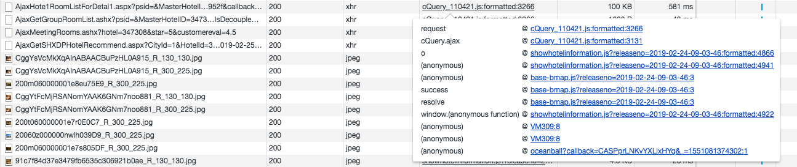

## 携程(Ctrip.com)酒店价格爬虫复盘

1. 找到正确的数据接口
2. 确定整体抓取思路
3. 破解请求参数
4. cookie的处理
5. 自动化处理

1. 抓取数据，首先得明确你需要得数据从哪来，我本次抓取得需求就是抓取携程网站上面得酒店价格，先打开一个页面，如:http://hotels.ctrip.com/hotel/347308.html。

我需要的价格数据就是这个1321，以及和这个房型相关的早餐，取消等信息。确定之后，打开调试工具，在Network中找到这个数据来自接口http://hotels.ctrip.com/Domestic/tool/AjaxHote1RoomListForDetai1.aspx

在这里可以灵活运用chrome开发工具的搜索功能。确定接口之后，参看这个接口的参数的请求头，在这里可以把这个请求全部copy下来，

然后打开postman查看会清晰很多，而且便于调试:`Import` -> `Paste Raw Text` -> `Import`

然后会看到很清晰的看到每一个请求的参数，也非常便于调试，这应该是每一个爬虫er必备的技能吧。

看了一圈之后，会发现除了有3个参数的含义不确定之外，其他参数的含义应该还是比较好懂的，下面来重点看下这3个参数：eleven， callback， _

1. 其实这3个参数中除了eleven之外，另外2个都非常简单。先看callback，查看这个请求的调用链，会发现

这两个参数都来自这个js文件，实现逻辑也非常简单，这个地方我们可以用python模拟实现(比较省时省力)

2. 还有一个eleven参数，这个稍微复杂一点，但是如果比较清楚整个调用链的话，还是比较简单的。可以看上上张图调用链的最后一个，结合AjaxHote1RoomListForDetai1.aspx这个接口来看的话就明白了。

可以看出，AjaxHote1RoomListForDetai1.aspx这个接口所需要的参数来源可能就是oceanball?callback=CASPprLNKvYXLlxHYq&_=1551081374302:1这个js文件返回的内容，而这个参数显而易见就是eleven参数。

3. 现在就是需要解决eleven这个参数是怎么来的。点击oceanballcallback=CASPprLNKvYXLlxHYq&_=1551081374302:1这个文件，然后左下角pretty print，有js经验的人会发现这是一个eval函数，可以替换成console.log()，这个地方可以使用Chrome Source下面的snippet工具(非常好用的js调试工具),粘贴替换之后执行一下，会在Console中输出内容，复杂粘贴到snippet中，格式化：

   可以看到这个就比较像正常的js代码了，大致浏览一遍，会发现有几个坑，这几个地址是和我们要抓取的地址是一样的，可见携程的反爬做到的粒度还是比较细的，不过好在我们火眼金睛，一眼久看穿了这些伎俩，我们后期重新模拟实现的时候这个地方替换成我们要抓的地址就行了。然后最后，把这个函数的new Function语句改成console.log就好了

   最后重新执行，会发现得到的参数和最初看到的参数是一样的，完美！

     

   

   

4&5  参数搞定之后剩下来就是cookie的处理了，这个地方可以用一个非常简单实用的方法。用selenium定时打开携程的网站，然后把cookie保存下来，定时(每半个小时)更新一次。这部分代码久不贴上来了，需要的可以Email我，我私法给你。上述破解参数的代码我已上传至 [github](https://github.com/wendy-w/ctrip_hotel_price_crawler)

，欢迎copy，如果有用，请给个star哈。